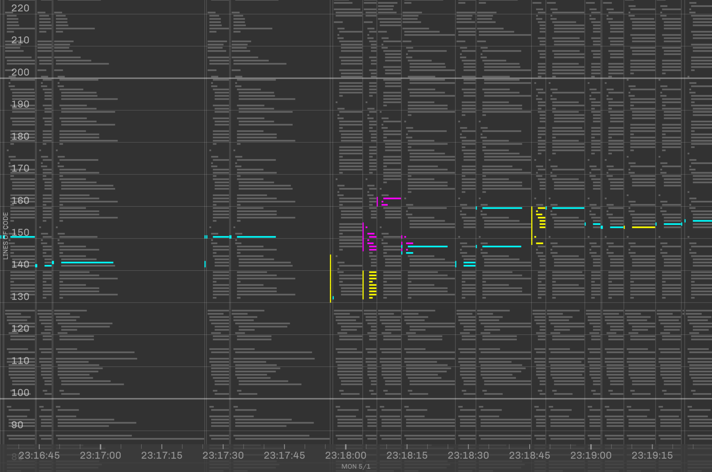

# Changes

I've always been curious as to how I write code.

As I wrote code for [another final project](https://github.com/willy-vvu/EmojiGame), I used a homemade keylogger to track every character I added and removed from the file. From the day the project was assigned to the day it was due, I collected almost 100 megabytes of raw data.

Next, I began building a visualization. I wanted to expose the data at all scales, revealing processes from the order of weeks (sleep/wake cycles) to the order of milliseconds (keyboard "gait"), and all levels in between. I also wanted to let the user take in the dataset at their own pace, freely zooming and pan around to inspect features of interest across scales, "Google Maps style". Rendering the data at interactive frame rates turned out to be quite a challenge, which I fought with preprocessing, data reduction algorithms, and rendering optimizations. The result? Explore for yourself.

[View in Browser](https://willy-vvu.github.io/Changes/)

Scroll or Right-click-drag to zoom.

---

Assignment for: 4.032 Information Design (Final Project)

Learning Focus: Data Collection, Interactive Graphics, Interaction Design, Performant JavaScript

Media: Interactive Visualization, Website

Software: p5.js, JavaScript

Date: May 2017
