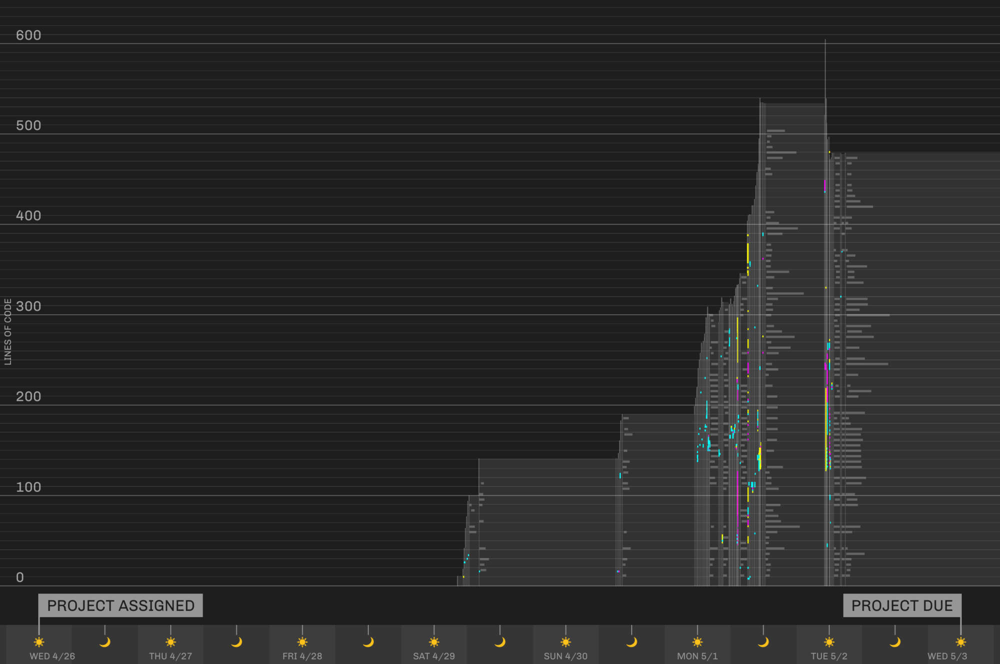
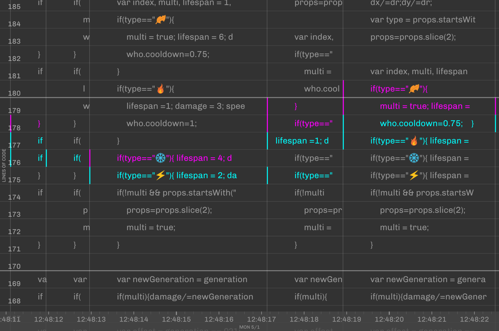

# Changes

I've always been curious as to how I write code.

As I wrote code for [another final project](https://github.com/willy-vvu/EmojiGame), I used a homemade keylogger to track every character I added and removed from the file. From the day the project was assigned to the day it was due, I collected almost 100 megabytes of raw data.

[View in Browser](https://willy-vvu.github.io/Changes/)

Scroll, Pinch, or Right-click-drag to zoom.

Zoom in far enough and you'll be able to read every letter of the source code, after every keypress. The scale on the bottom of the screen transitions seamlessly from days, to hours, to minutes, all the way to the millisecond. I sought to expose the data at all scales, revealing everything from sleep/wake cycles to the rhythm of keystrokes. You can even see the small hole in the data when my keylogger got overwhelmed and crashed between Monday and Tuesday. Perhaps a non-interactive visualization could offer similar insights, but for me, the fun was in the fluidity of navigating and exploring the dataset in real time.

Rendering the data at interactive frame rates turned out to be quite a challenge. There's a lot of trickery going on under the hood: Source code strings are truncated to reduce the number of characters drawn to the screen, switching over to shaded rectangles when zoomed out. At all but the closest of zoom levels, a combination of binary search and linear scan is used to reduce the dataset to more manageable approximation that still preserves important details, calculated and cached only as needed when the user zooms or pans.
  

Of course, the bulk of the data processing and sorting happens during the "loading screen", where I display a quick animated intro to the user while diffs are calculated, indices built, and all stored into efficent data structures to reduce the load during rendering.

---

Assignment for: 4.032 Information Design (Final Project)

Learning Focus: Data Collection, Interactive Graphics, Interaction Design, Performant JavaScript

Media: Interactive Visualization, Website

Software: p5.js, JavaScript

Date: May 2017
